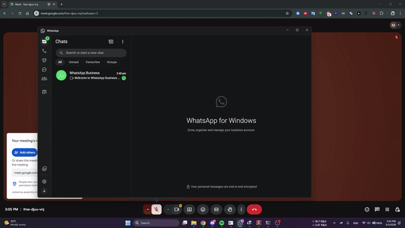
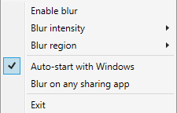

# Gausslite

**Sharing your screen shouldn't expose your DMs.**

Whether you're presenting to your professor while shit-talking them in the group
chat, or in a work meeting and the friend chat is going off — Gausslite quietly
blurs WhatsApp Desktop the moment you start sharing your screen.

---

## What it does

Gausslite watches for active screen-share sessions in **Zoom**, **Microsoft
Teams**, **Google Meet**, browser-based **Discord**, and any other browser
share that uses WebRTC. The instant a share starts, it overlays a real
GPU-accelerated Gaussian blur on WhatsApp Desktop. When the share ends, the
blur disappears.

- **Auto-on, auto-off** — no toggle, no panic. Zero clicks.
- **Real GPU blur** — Win2D-backed, not a flat opaque rectangle.
- **Region-aware** — choose to blur the chat list, the open conversation, or
  both (right-click tray → Blur region).
- **Adjustable intensity** — Light / Medium / Heavy presets keep silhouettes
  readable for *you* while staying unreadable to viewers.
- **Manual override** — left-click the tray icon, the global hotkey
  (Ctrl+Shift+B), or the menu always work. If you disable blur mid-share,
  Gausslite quietly remembers and turns it back on next time you share.
- **Tray-only** — no window clutter, no taskbar entry.

## Get it

Download the latest installer or portable zip from the
[Releases page](https://github.com/mohamedasem318/Gausslite/releases/latest).

- **Installer** (`GaussliteSetup-X.Y.Z.exe`) — recommended for most users.
  Per-user install (no admin / UAC), adds Gausslite to your Start Menu,
  registers an uninstaller.
- **Portable** (`Gausslite-X.Y.Z-portable.zip`) — unzip and run, no install.

> **Why does Windows warn me about this?**
>
> The installer isn't code-signed yet — signing certificates cost money and
> Gausslite is a free side project. On first run, Windows SmartScreen will
> say *"Windows protected your PC"*. Click **More info → Run anyway** to
> proceed. The warning fades on its own as more users download the file.
> If you'd rather not click through, build from source — see
> [BUILDING.md](BUILDING.md).
>
> **Rare case — silent block instead of SmartScreen:** if you've enabled
> Microsoft Defender's *"Use advanced protection against ransomware"* rule
> (an opt-in Attack Surface Reduction policy, off by default on consumer
> Windows; usually only on in enterprise-managed setups), Defender will
> block the unsigned binary outright and you'll see a generic *"Windows
> cannot access the specified device, path, or file"* dialog instead of
> SmartScreen. Workaround until the binary builds enough cloud-protection
> reputation: open PowerShell as Administrator and run
> `Add-MpPreference -AttackSurfaceReductionOnlyExclusions "$env:LOCALAPPDATA\Programs\Gausslite"`,
> then install. Most users won't hit this.

## Requirements

- **Windows 11 22H2 (build 22621)** or newer.
- **DirectX 11 capable GPU** (anything from the last ~15 years).
- **WhatsApp Desktop** installed (Microsoft Store or Win32 build).
- **x64** architecture. ARM64 support is on the roadmap.

## What it doesn't do (yet)

- **Discord desktop screen sharing is not auto-detected.** Discord renders its
  share controls as Chromium web content invisible to standard Windows window
  enumeration. Workarounds: use the global hotkey, the tray left-click, or
  share via Discord-in-browser (which IS auto-detected).
  Tracked: [#38](https://github.com/mohamedasem318/Gausslite/issues/38).
- **Multi-monitor share-target detection.** If WhatsApp is on monitor 2 but
  you only share monitor 1, Gausslite still blurs (privacy-first default).
  Tracked: [#40](https://github.com/mohamedasem318/Gausslite/issues/40).
- **Other chat clients** (Signal, Telegram, Slack DMs, etc.) — WhatsApp is
  the v0.x focus. Multi-app support may follow post-v1.0 based on demand.

## Why "Gausslite"?

Portmanteau of *Gaussian* (the blur) and *gaslighting* (what you're doing to
your viewers when they see WhatsApp on your screen but can't read a word of
it). The blur is real; the deniability is up to you.

## Roadmap

- [x] **v0.1.0** — Overlay-based whole-window blur for WhatsApp Desktop.
- [x] **v0.1.1** — Renamed from internal codename, no functional changes.
- [x] **v0.2.0** — Region-aware blur (chat list vs. conversation), intensity
      presets, partial-occlusion handling, RTL support.
- [x] **v0.3.0** — Auto-activation: detect Zoom / Teams / browser-based shares,
      blur fires within ~2 s of share start, manual override sticks per share.
- [x] **v0.3.5** — Settings persistence, "Auto-start with Windows" toggle,
      "Blur on any sharing app" toggle (Discord-desktop workaround), installer
      + portable zip.
- [ ] **v0.3.x follow-ups** — Discord desktop UIA detection
      ([#38](https://github.com/mohamedasem318/Gausslite/issues/38));
      share-target detection
      ([#40](https://github.com/mohamedasem318/Gausslite/issues/40)).
- [ ] **v0.4.0** — Settings window, continuous blur intensity slider,
      per-app share-client checklist, opt-in repaint timer, manual updater.
- [ ] **v0.5.0** — Toast notification blur during screen sharing.
- [ ] **v1.0.0** — Composite-window mode: share a Gausslite window that
      renders the desktop with selective blur baked in. No drivers, no signing.
- [ ] **v2.0.0** — Indirect Display Driver: phantom monitor as a separate
      WDDM driver so the real monitor stays untouched. Requires code-signing.

See [PLAN.md](PLAN.md) for milestone details and the architectural rationale
behind the v0/v1/v2 split.

## License

Gausslite is licensed under the
[GNU Affero General Public License v3.0](LICENSE). You're free to use,
modify, and distribute the software, but any modified version — including
running it as a network service — must be released under the same license
with source available to its users.

**Need a non-AGPL license** for embedding in proprietary software or any
other use case the AGPL doesn't accommodate? See [COMMERCIAL.md](COMMERCIAL.md)
for commercial licensing terms.

## Disclaimer

Gausslite is an independent open-source project and is **not affiliated with,
endorsed by, sponsored by, or connected to WhatsApp LLC, Meta Platforms, Inc.,
or any of their subsidiaries**. "WhatsApp" is a trademark of WhatsApp LLC.
Gausslite does not modify, repackage, or interfere with the WhatsApp
application itself; it operates as a separate privacy utility that processes
the visual output of windows on the user's own desktop. References to
"WhatsApp" in this project's code, documentation, and user interface exist
solely to identify the target application for the user's privacy convenience.

This software is provided "as is", without warranty of any kind. The author
assumes no liability for any consequences arising from the use of this
software, including but not limited to: failure to blur sensitive content,
incompatibility with future versions of WhatsApp Desktop, or any privacy
incident occurring during screen sharing.

## For developers

- [BUILDING.md](BUILDING.md) — how to build from source, dependencies,
  test commands, x64 quirks.
- [CONTRIBUTING.md](CONTRIBUTING.md) — how to propose changes, what gets
  merged, license assignment for contributors.
- [PLAN.md](PLAN.md) — full milestone breakdown, architecture, decisions log.
- [STATE.md](STATE.md) — current state and active work.
- [HISTORY.md](HISTORY.md) — verbose session-by-session development notes.
- [CHANGELOG.md](CHANGELOG.md) — user-facing release notes.
- [tools/README.md](tools/README.md) — diagnostic / recon utilities used
  during development. Not part of the shipped app.

## Citation

If you use Gausslite in academic work or build on top of it, an
acknowledgement is appreciated but not legally required beyond what AGPL-3.0
mandates:

> Assem, M. (2026). *Gausslite: Automatic chat blur for screen sharing.*
> https://github.com/mohamedasem318/Gausslite

## Contact

Mohamed Assem — [Portfolio](https://mohamedasem318.github.io/portfolio) ·
[LinkedIn](https://linkedin.com/in/mohamedasem318) ·
`mohamedasem318@gmail.com`

For commercial licensing, see [COMMERCIAL.md](COMMERCIAL.md).
